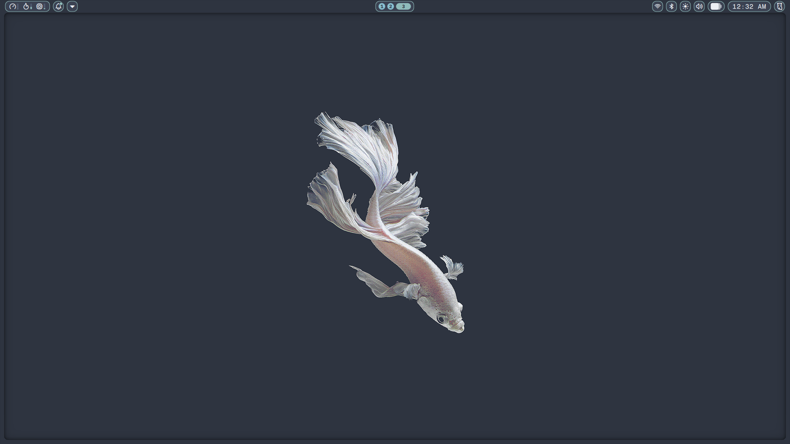
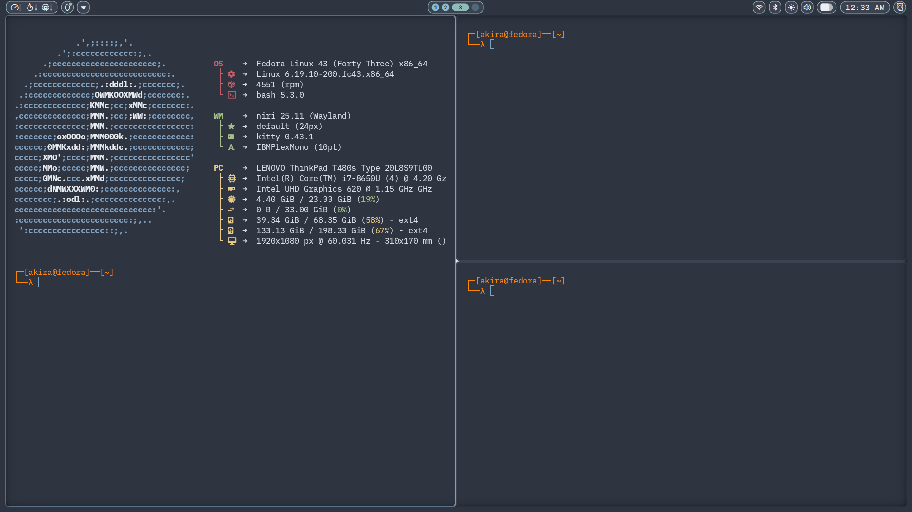
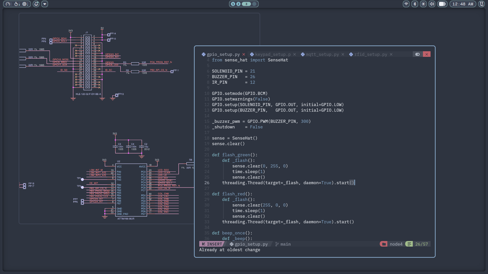
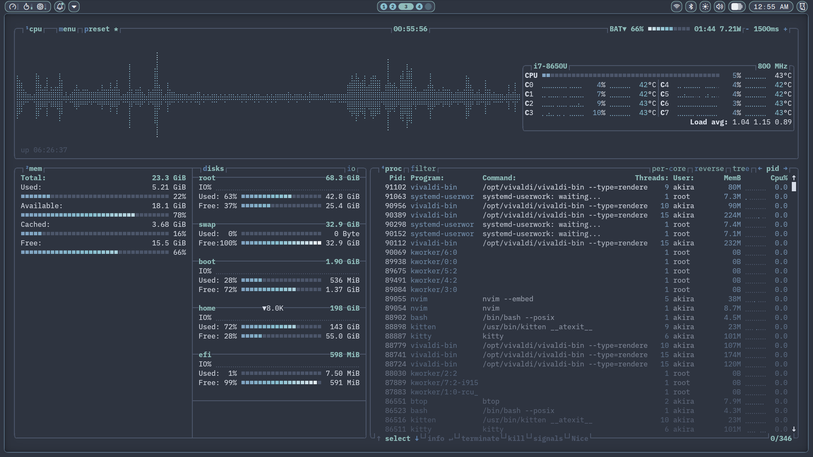
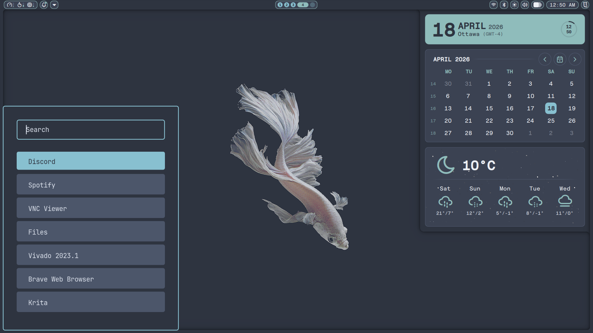
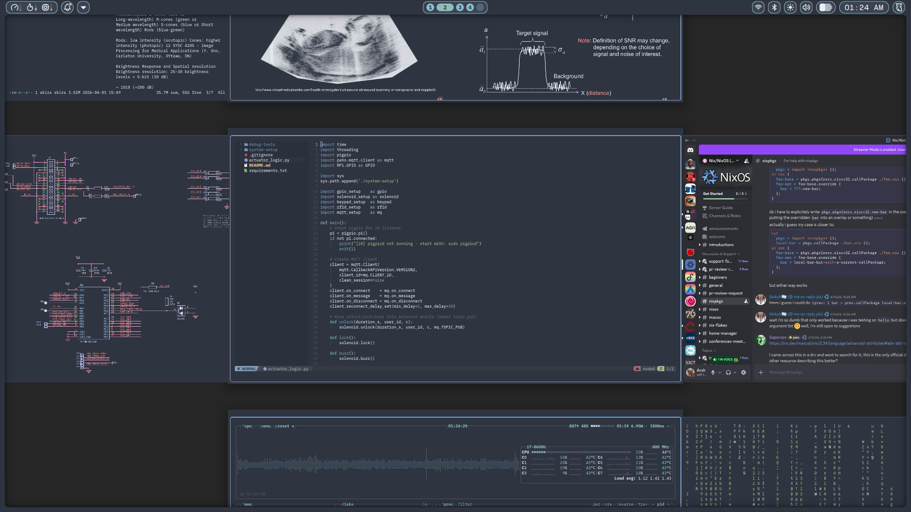

# My dotfiles

This repository contains the dotfiles for my Linux system which are 
maintained by [GNU Stow](https://www.gnu.org/software/stow/)

Theme/Colorscheme: [Nord](https://github.com/nordtheme) 

Compositor: [Niri](https://github.com/niri-wm/niri)

## Screenshots

## An example of a typical work environment

## Wallpaper

