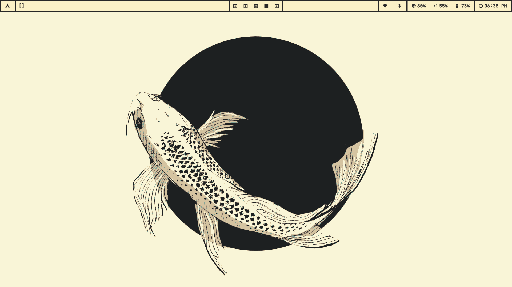
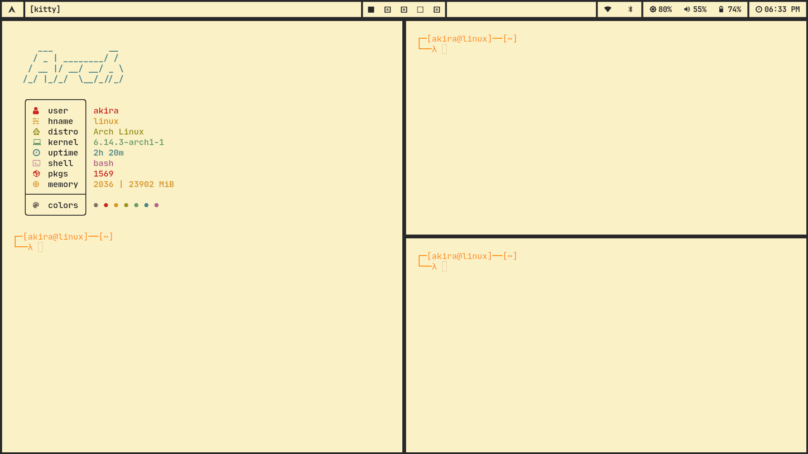
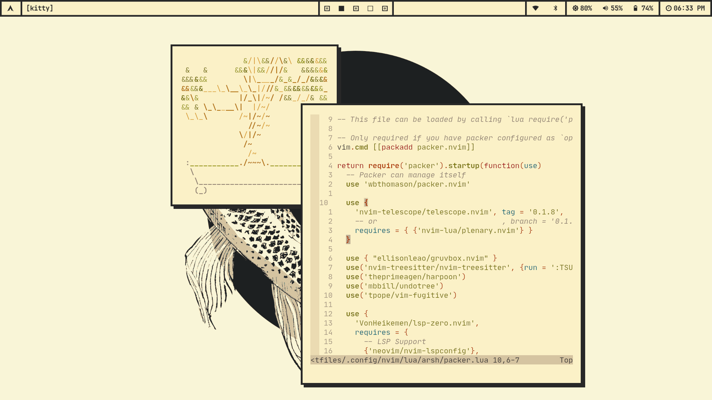
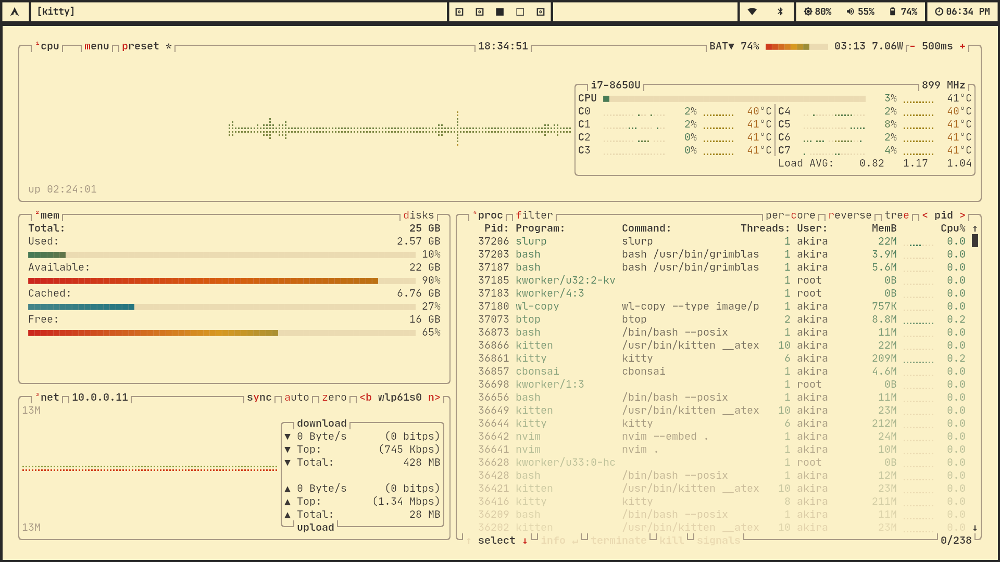
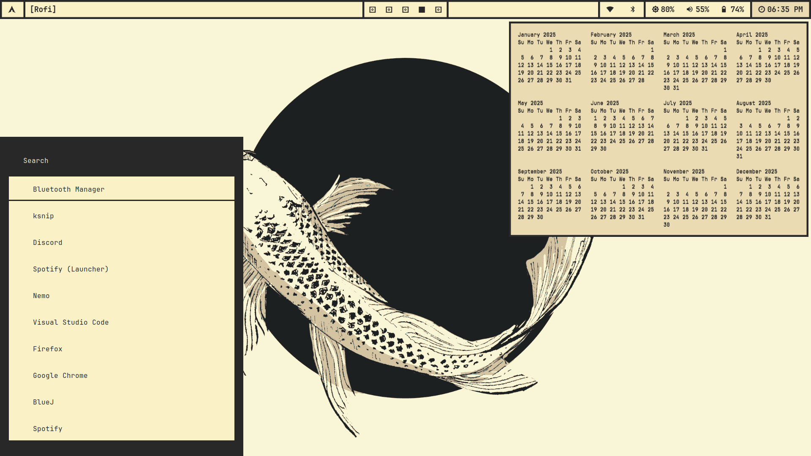
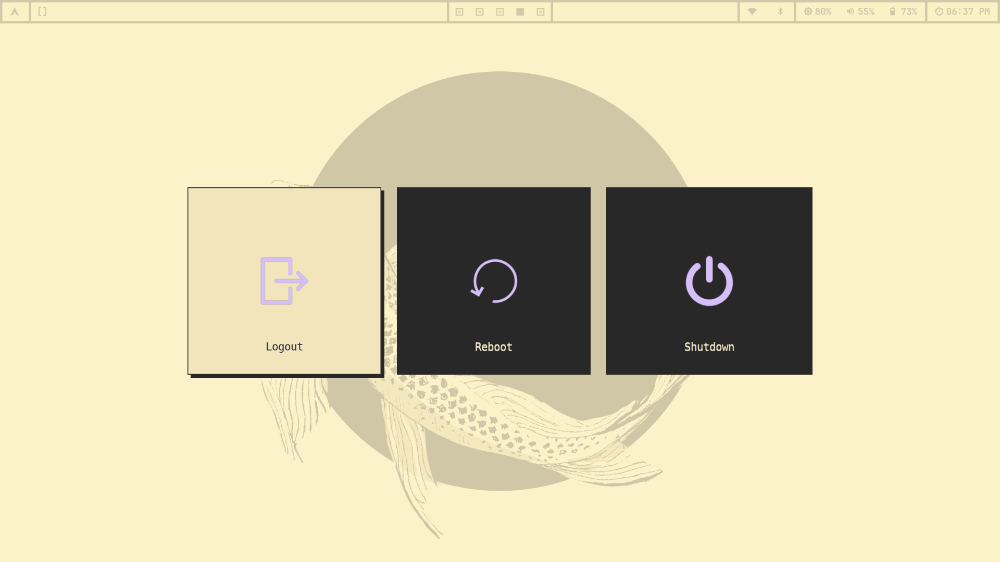

# My dotfiles

This repository contains the dotfiles for my Arch Linux system which is 
maintained by Git and [GNU Stow](https://www.gnu.org/software/stow/)

```
pacman -S git stow
```

The overall theme of my setup has been inspired by neobrutalist design and 
the [gruvbox](https://github.com/morhetz/gruvbox) colorscheme

## Screenshots








## Wallpaper


